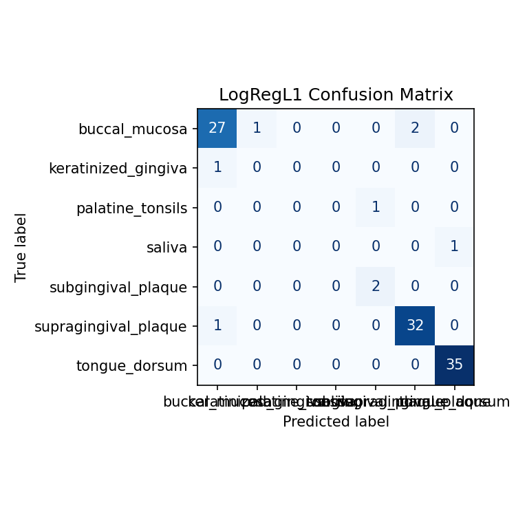
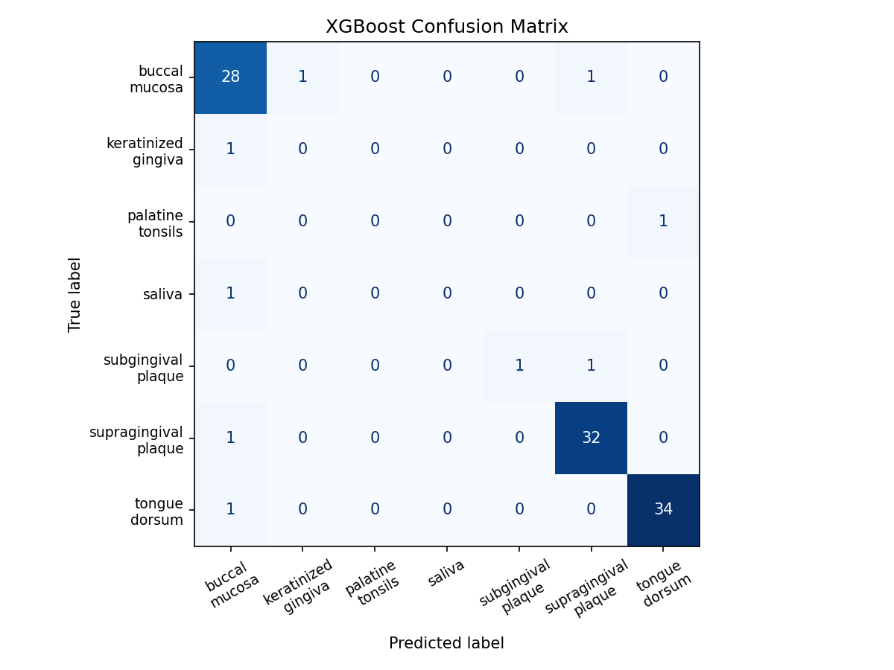
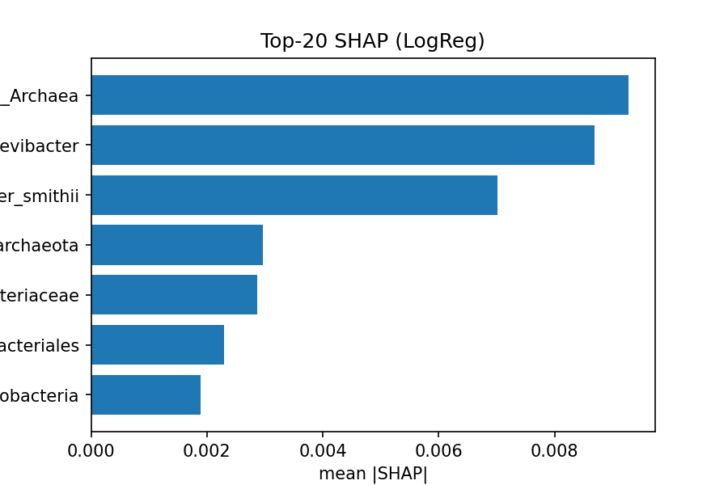
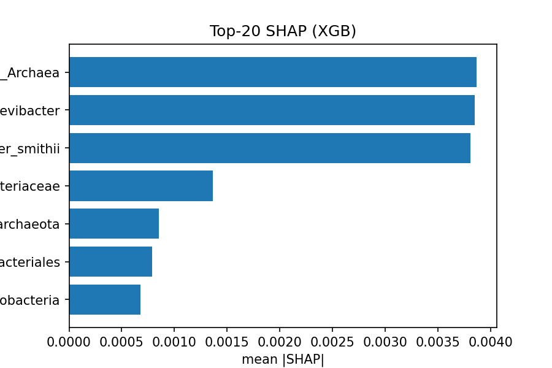

# Oral Microbiome (HMP) — Oral Subsite Classification (CoDA + SHAP)

## What
Classify **oral subsites** (tongue/buccal/plaque/saliva/…) from 16S profiles using **compositional data analysis (CLR)** and ML (L1-LogReg & XGBoost). Reproducible scripts + figures included.

## Data
- Kaggle: `antaresnyc/human-metagenomics` (contains `abundance.csv`)
- We filter **oral sites** and apply **relative abundance → CLR** transform.

## Reproduce
    # prepare (generate features_clr.csv & labels.csv)
    python scripts/prepare_hmp_oral.py
    # train + explain (save confusion matrices & SHAP bar plots)
    python scripts/train_microbiome_clf.py

## Results (this run)
    LogRegL1  acc=0.932  macroF1=0.522
    XGBoost   acc=0.922  macroF1=0.500

## Figures

## Notes
- Pipeline: feature filter (≥1% present) → relative abundance → **CLR** → models (LogReg L1 / XGBoost).
- Explainability: **SHAP** top-20 features; map taxa to (e)HOMD for biological insight.
- Splits: 80/20 stratified; set `random_state=42` for reproducibility.
- Caveats: public metagenomics mix datasets/batches; results reflect subsite separability, not clinical diagnosis.
- Disclaimer: research/education only, **not** for clinical use.

